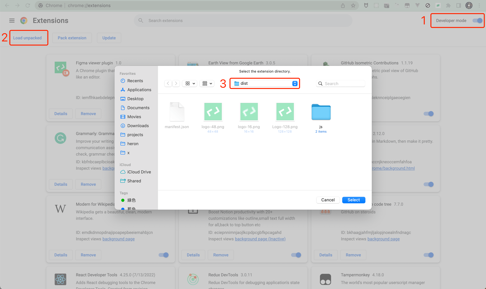

# Figma viewer chrome plugin
For now Figma plugins are only available for editors. This project is a solution for viewers. You can do many things by this. For example, create a plugin for better inspect experience for developers.

> **Note**<br/>
> It's a Chrome plugin, not a figma plugin.

https://user-images.githubusercontent.com/12868055/202880945-8ec23e51-0047-4992-974a-f8d5e4e57279.mp4

## Features
- Light and dark mode following Figma theme
- Dragable anywhere in the window
- Expand and collapse

## Development
Install dependencies.
```bash
yarn
```

Setup dev mode.
```bash
yarn dev
```

Just change the code of `src/ui/Main.tsx`. You can use the object `figma` directly. No `postMessage` needed.

Build.
```bash
yarn build
```

## Usage
1. Open extensions management  `chrome://extensions/` in Chrome.
2. Enable developer mode at top right corner.
3. Select Load unpacked at top left.
4. Select `dist` folder.


